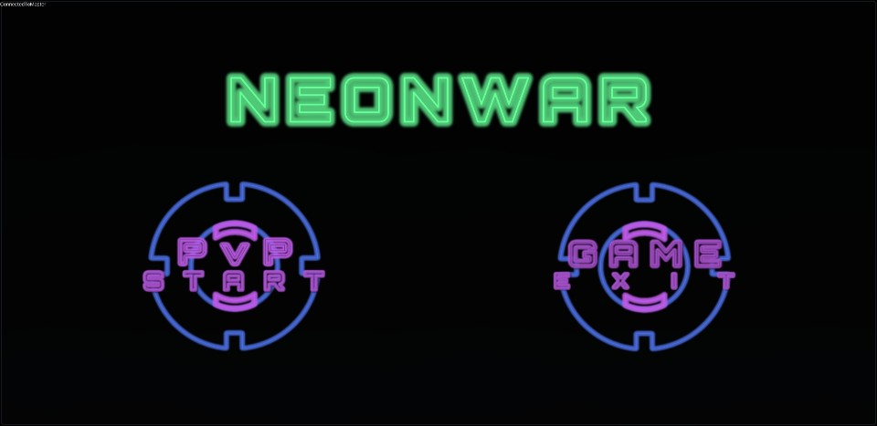
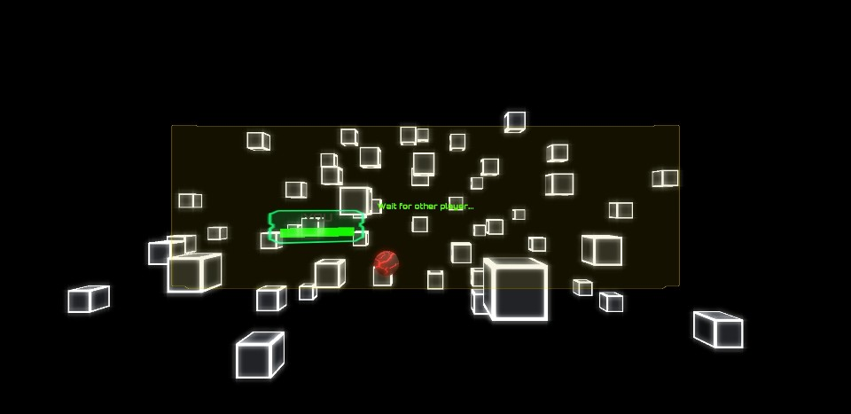
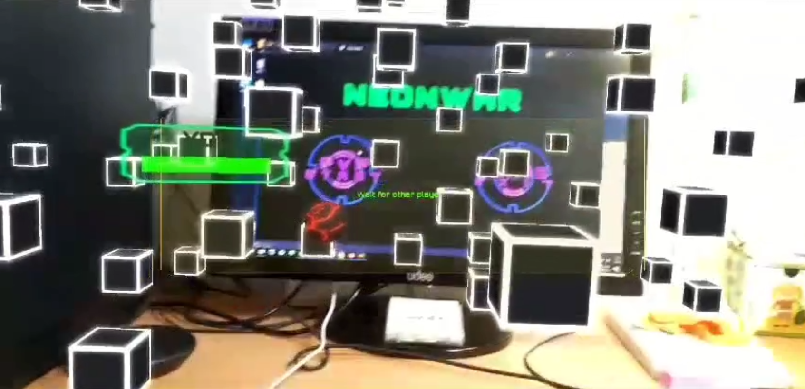
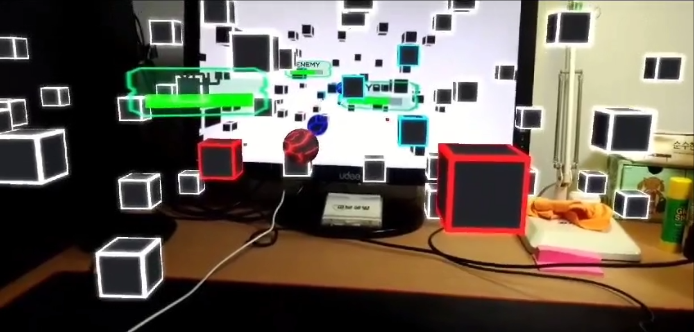
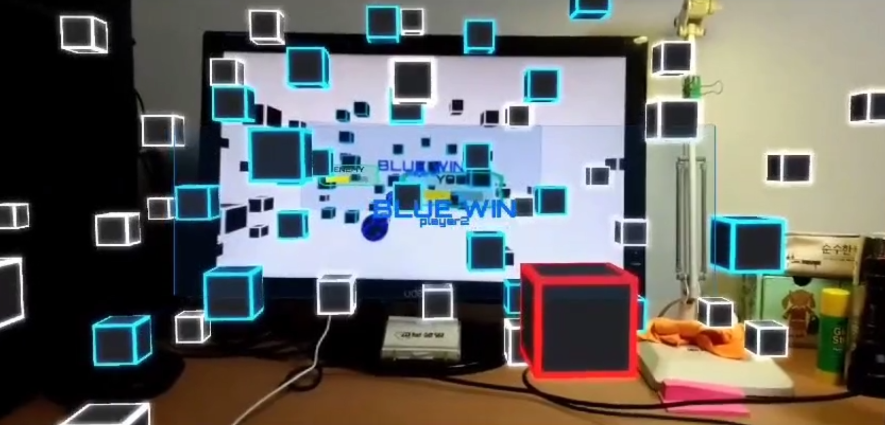

# NeonWar
AR Core Multi play game Project
********************************************************************************************************
<article>
<b>#Project Member :</b> 2 Programmers 
<b>#Language :</b> C# 
<b>#Platform :</b> Android 
<b>#Date :</b> 2017 
<b>#Video Link :</b> https://youtu.be/r5G2s0cCwv8 
</article>
 

<body>
  <h1>요약</h1>
  

    

      4차 산업혁명을 기반으로 새롭고 다양한 기술들이 등장하고 그 중 증강현실의 최신 툴 AR Core를 경험해 보고 싶은 마음에 시작한 작은 프로젝트
        
    

  

  
  <h1>주요 요소</h1>
  

  <li>
    <ol>
      <li><b>다음 항목들을 이용해 제작</b> 
        <ol>Photon 서비스</ol>
        <ol>AR Core</ol>
        <ol>Unity 3D</ol>
      </li>
        
      <li><b>게임</b> 
        - 메인 메뉴에서 게임 시작을 통해 Photon서버에 Room을 생성 
         
      </li>
       
      <li><b>카메라 지면 인식</b> 
      - 룸 생성 후 카메라로 지면을 인식하여 게임 오브젝트의 초기 위치 할당 
       
      </li>
       
      <li><b>대전</b> 
      - 상대방이 입장하면 자동으로 5초 카운터 후 게임 시작 
      - 각 플레이어는 구체의 행성이 주어지며 행성의 체력이 0이되어 파괴되면 패배 
      - 주변의 상자를 클릭하면 색상이 변하며 해당 색상의 반대되는 플레이어의 행성을 텀을 두고 자동 공격 
       
      </li>
       
      <li><b>종료</b> 
      - 둘 중 하나의 행성이 먼저 파괴되면 승자를 알리는 UI 출력 
      - 짧은 시간 뒤 메인 메뉴로 강제 복귀 
       
      </li>
    </ol>
  </li>
  

</body>
